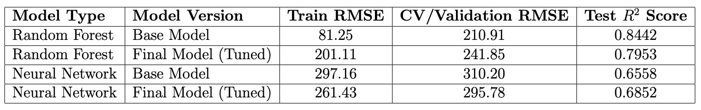
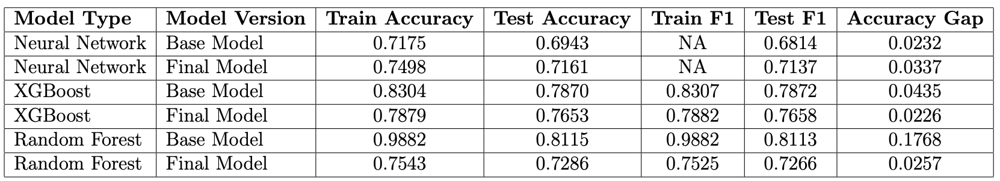
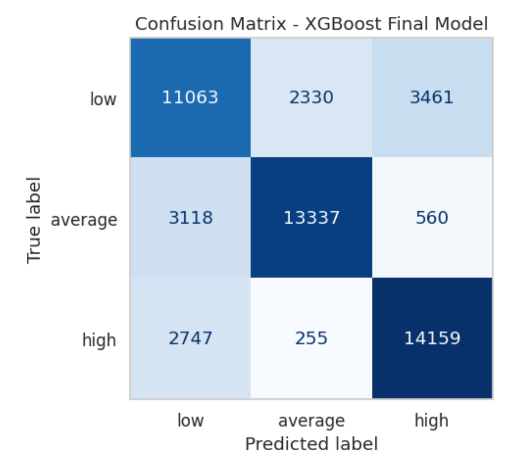

# Housing-Price-ML-and-DL-Analysis

The project was developed as part of academic coursework for the course *Machine And Deep Learning* (MSc. in Business Administration and Data Science).

The focus of the project is to understand how machine and deep learning models can be used to model complex relationships in real estate data, and what insights such models can provide for decision-making in practice.

## Project Background

Housing prices in the U.S. are influenced by multiple interacting factors such as location, property size, and market conditions. Traditional valuation approaches often struggle to capture these nonlinear relationships.

This project approaches the problem from a data-driven perspective:

- How well can machine learning models predict rental prices?
- Can properties be meaningfully grouped into price categories?
- Which features drive price differences?

## Dataset

The dataset used in this project can be found <a href="https://www.kaggle.com/code/saurav9786/rent-price-recommender/input" style="text-decoration: underline;">**here**</a>

- Source: Kaggle  
- Size: ~100,000 listings  
- Final dataset after cleaning: 91,945 observations, 10 features  
- Features include:
  - Numerical: price, bedrooms, bathrooms, location  
  - Categorical: city, state, amenities  

Missing values and duplicates were handled, and the dataset was further transformed and engineered to improve model performance.

## Approach

The analysis follows a standard machine learning workflow:

- Data cleaning and preprocessing  
- Exploratory data analysis  
- Feature engineering and transformation  
- Model training and evaluation  

Models used:

- Linear Regression  
- Decision Tree  
- Random Forest  
- Gradient Boosting  
- XGBoost  
- KNN  
- Naive Bayes  
- Neural Networks (MLP)

Model selection and optimization were based on cross-validation and performance metrics.

# Key Results

- Ensemble models like Random Forest and XGBoost achieved the strongest performance

- Random Forest explained **~80% of variance (R² ≈ 0.80)** in price prediction
  
**Regression Results**


- XGBoost achieved **~76.5% classification accuracy** for price categories

**Classification Results**

  
**Error Analysis of XGBoost model (Classification)**
 

- Neural Networks required more tuning but did not outperform tree-based models on this dataset

Feature importance analysis showed that:

- Property size  
- Number of bedrooms and bathrooms  
- Geographic location  

were the most influential variables in both regression and classification tasks.

## Practical Implications

- Model choice affects both performance and interpretability in real applications  
- Simpler models can perform well, but may fail to capture complex relationships  
- Ensemble methods provide strong performance but require careful tuning  
- Neural networks are powerful but depend heavily on data size and structure  
- Data preprocessing and feature engineering are critical for reliable results  

These findings reflect common trade-offs in applied machine learning projects.

## Impact and Implications

This type of modeling approach can support decision-making in the following contexts:

- Assisting property managers in setting data-driven rental prices  
- Supporting platforms in organizing and categorizing listings  
- Helping users identify fair market segments  
- Enabling analysis of housing market trends at scale  

At the same time, several considerations are important:

- Models depend heavily on the quality and completeness of data  
- Predictions should be interpreted as support tools, not absolute truths  
- External factors such as economic conditions are not fully captured  

Overall, this project demonstrates how machine learning can support structured decision-making, while also highlighting the need for careful interpretation and validation in real-world use.

## Project structure

```
nlp-mental-health-classification/
│
├── images
  └── Classification_Results.png
  └── Reression_Results.png
  └── XGB_Error_analysis.png
├── README.md
└── us_rental_ml_dl.ipynb
└── us_rental_ml_dl_report.pdf
```

## Notes

The goal of this exam project was to:
- understand the behavior of different models  
- evaluate their strengths and limitations  
- and connect technical results with practical implications  

The full analysis, methodology, and detailed results are documented in: `us_rental_ml_dl_report.pdf`


#### **Recommendations**

Based on the uncovered insights, the following recommendations have been provided:

- **Leverage Ensemble Models**: Use Random Forest for rental price prediction, as key predictors like square footage (22%) and bedrooms/bathrooms (18%) strongly influence pricing trends.

- **Optimize Market Segmentation**: Apply XGBoost (76.53% test accuracy) to classify listings into low, medium, and high price tiers, helping renters find fair deals and increasing visibility for premium listings.

- **Prioritize High-Value Locations**: Focus on urban clusters and prime neighborhoods, where geographic location explains 15% of price variance, to maximize returns and align with historical rent growth patterns.

